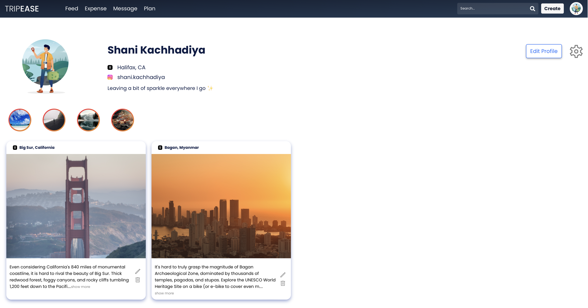
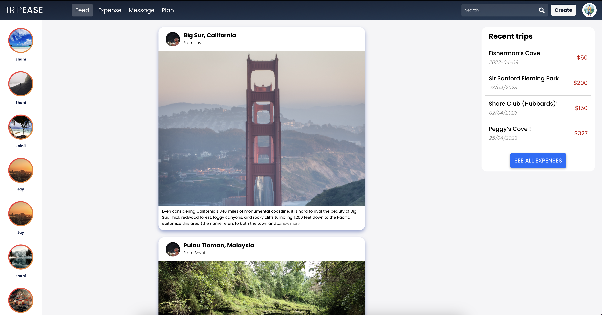
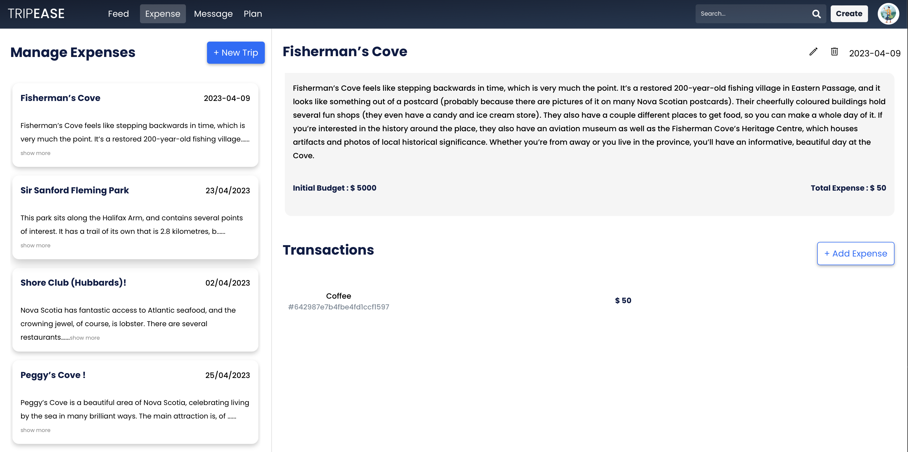
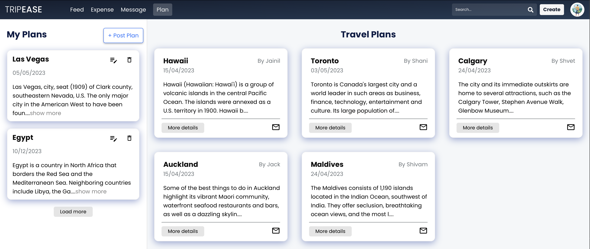

# **TripEase**

### A platform for travel enthusiasts to share content and upcoming trip plans with the community, manage and pay their trip expenses and explore new travel destinations.

### TripEase is a web application designed to make travel planning and management more convenient and efficient for users. The goal is to provide travel enthusiasts with a platform where they can plan and organize their trips with ease, while also facilitating collaboration among friends and family members who may be traveling together. We understand that travel can be a time-consuming and stressful experience, which is why we want to simplify the process by offering features that streamline the planning and management of trips.

### [Live Application Link](https://tripeasego.netlify.app/)

## User Interface

### User Profile



### Home Page



### Manage Expenses



### Plans



# **Getting Started**

### **Prerequisites to run the application**

Create `.env` file at the root level of `server` directory and create an environment variable. This file will look like this:

```
MONGO_CONNECTION_URL = <PASTE URI OF MONGODB>
CLIENT_URL = <PASTE URL OF CLIENT>
STRIPE_API_KEY = <PASTE URI OF STRIPE API>
```

- _Node and npm is the primary requirement_. Run the following command to check if node and npm is available in your system:

```
node -v
npm -v
```

- _Git cli:_ Download Git command line interface using this [link](https://git-scm.com/downloads). If you are not sure if you have installed git on you machine, run the following command:

```
git -v
```

## How to run application

After Installing Git,

The first step is to clone the repo in your machine using the below command.

Next, Change the directory to the client side of the project using:

```
cd .\TripEase\client
```

Next step is, run the below command to instal all the packages and dependencies that is required to run the Assignment.

```
npm install
```

You are all set and now just run the client side using following command.

```
npm start
```

Now, To run the server side, open the cmd with the path of the project's repo.

Next, Change the directory to the server side of the project using:

```
cd .\TripEase\server
```

Next step is, run the below command to instal all the packages and dependencies that is required to run the Assignment.

```
npm install
```

You are all set and now just run the server side using following command.

```
npm start
```

Both the server are now up and running.

# **Folder Structure Used**

### React App

```
client
├── public
│   ├── images
├── src
│   ├── assets
│   ├── components
│   ├── constants
│   ├── layouts
│   ├── pages
│   ├── redux
│   ├── utils
├── App.scss
├── App.js
├── index.js
└── index.css
```

In a React frontend application, there are several essential directories and files to structure the project. These include the node_modules directory, which stores all the project dependencies, the public directory, used for storing static assets such as images and fonts, and the src directory, which contains reusable components in a components directory and page components in a pages directory. The main component that serves as the root of the app is App.js, while index.js renders the app to the index.html file. The package.json file contains important information about the project.

### Node App

```
server
├── Assets
├── Controllers
├── Middlewares
├── Models
├── Routes
├── Utils
├── .env
├── server.js
```

I implemented an MVC (Model-View-Controller) architecture, consisting of three primary directories: Controllers, Models, and Routes. To separate the business logic from publicly accessible assets such as images and documents, I placed the static files outside of the server's core code. All the constant strings used in the server code are stored in the ".env" directory. As the application grows and new features are added, the "server.js" file becomes critical for scalability. This file contains all the configuration information, including the backend server's URL, for the node application.

# **Softwrae/Library/plug-in used**

To have a local copy of this lab / assingnment / project up and running on your local machine, you will first need to install the following software / libraries / plug-ins

- [VS Code](https://code.visualstudio.com/)
- [Node](https://nodejs.org/en/)
- [npm](https://www.npmjs.com/)
- [Express.js](https://expressjs.com/)
- [Postman](https://www.postman.com/)
- [nodemon](https://www.npmjs.com/package/nodemon)
- [mongoose](https://www.npmjs.com/package/mongoose)
- [MongoDB Atlas](https://www.mongodb.com/atlas)
- [MongoDBCompass](https://www.mongodb.com/products/compass)
- [axios](https://www.npmjs.com/package/axios)
- [moment](https://momentjs.com/)
- [react](https://react.dev/)
- [react-dom](https://legacy.reactjs.org/docs/react-dom.html)
- [react-icons](https://react-icons.github.io/react-icons/)
- [react-redux](https://react-redux.js.org/)
- [react-router-dom](https://www.npmjs.com/package/react-router-dom)
- [react-scripts](https://www.npmjs.com/package/react-scripts)
- [react-toastify](https://www.npmjs.com/package/react-toastify)
- [react-top-loading-bar](https://www.npmjs.com/package/react-top-loading-bar)
- [redux-logger](https://www.npmjs.com/package/redux-logger)
- [saas](https://www.npmjs.com/package/sass)
- [web-vitals](https://www.npmjs.com/package/web-vitals)
- [reduxjs-toolkit](https://www.npmjs.com/package/@reduxjs/toolkit)
- [cors](https://www.npmjs.com/package/cors)
- [dotenv](https://www.npmjs.com/package/dotenv)
- [morgan](https://www.npmjs.com/package/morgan)
- [multer](https://www.npmjs.com/package/multer)
- [stripe](https://www.npmjs.com/package/stripe)

### _Built With:_

- [Express.js](https://reactjs.org/)
- [Node](https://nodejs.org/en/)
- [npm](https://www.npmjs.com/)
- [MongoDB](https://www.mongodb.com/)
- [react](https://react.dev/)
